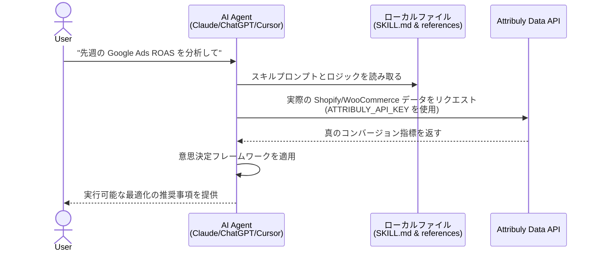
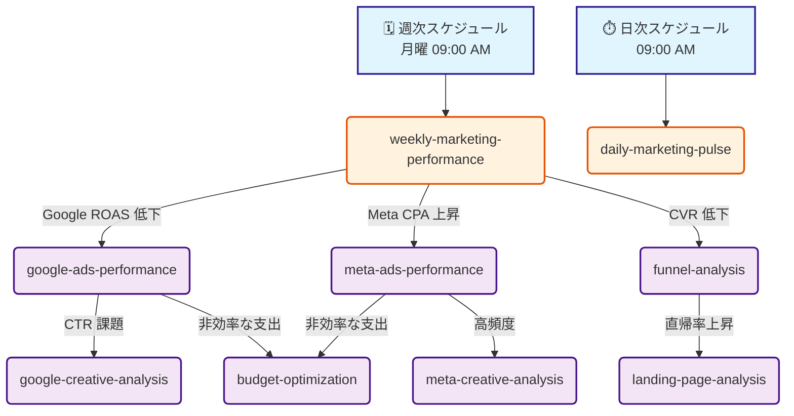

[English](./README.md) | [简体中文](./README.zh-CN.md) | **日本語**

# 🛍️ Attribuly AI マーケティング分析スキル：ChatGPT, Claude, Codex & OpenClaw 向けユニバーサルアナリスト

DTC Eコマース（Shopify、WooCommerce など）に特化した **AI マーケティング・パートナー**。Attribuly のファーストパーティデータを活用し、これらの **AI マーケティング Agent** スキルは、自律的なマーケティング分析、真の ROAS トラッキング、利益優先の最適化を提供します。**ChatGPT マーケティングプロンプト** フレームワークと API ロジックを使用し、強力な **Shopify データ分析** 体験を構築します。

## 🚀 動作原理 (Workflow)



### 自律的な診断とスキルチェーン (Autonomous Diagnostics & Skill Chaining)

スケジュールされたタスク（日次/週次）または指標アラートを設定することで、これらのスキルは自動的に連鎖し、深い根本原因分析を実行できます：



### なぜ Shopify と WooCommerce 向けなのか？

マーケティングにおける AI の主な課題は、誤ったアトリビューションだけではありません。一般的な AI には、**最初のアドクリックから最終的な購入までの完全なコンテキスト (Full Context) が欠けている** ことです。従来の広告プラットフォーム（Meta、Google など）は、それぞれ断片化されたジャーニーの一部しか見ることができません。Shopify や WooCommerce の販売者にとって、これらの AI スキルは店舗のバックエンドの実際の注文データを直接活用することで、そのギャップを埋めます。これにより、AI はエンドツーエンドの完全なカスタマージャーニーを把握し、**真の利益率、顧客獲得単価（CAC）、顧客生涯価値（LTV）** を明らかにし、実際の収益コンテキストに基づいたマーケティング診断と意思決定を可能にします。

### 主な機能:
- **真の ROI & ROAS へのフォーカス** — Attribuly のファーストパーティ・アトリビューションの概念（真の ROAS、新規顧客 ROAS (ncROAS)、利益、利益率、LTV、MER）を活用し、Meta/Google 広告プラットフォームの過剰なアトリビューションを削減します。
- **ユニバーサルな互換性** — ファイルの読み取りと API 呼び出しが可能な任意の AI エージェント（ChatGPT、Claude Code、Cursor、Trae、OpenClaw など）で動作します。
- **拡張可能なスキル** — 自動トリガーを内蔵。ファネル、予算消化ペース、クリエイティブ、データ乖離を自律的に分析します。特定のプラットフォームに縛られません。

### できること:
- **診断分析:** ファネルのボトルネックやランディングページの離脱要因を自律的に検出します。
- **パフォーマンス追跡:** 30秒で確認できる毎日の予算消化レポートや、詳細な週次エグゼクティブ・サマリーを生成します。
- **クリエイティブ最適化:** Google/Meta のクリエイティブを真の収益性に基づいて評価し、クリエイティブの疲労を特定します。
- **予算最適化:** 利益を最優先した予算の再配分やオーディエンス調整の推奨事項を取得します。

---

## 目次

- [利用可能なスキル](#利用可能なスキル)
- [他の AI Agent での使用方法 (インストール)](#他の-ai-agent-での使用方法-インストール)
- [マネージドクラウドホスティング（展開）](#マネージドクラウドホスティング展開)
- [Technical Reference（技術リファレンス）](#technical-reference技術リファレンス)

---

## 利用可能なスキル

### ✅ 利用可能 (Ready)

- `weekly-marketing-performance` — チャネル横断の週次エグゼクティブ・サマリー
- `daily-marketing-pulse` — 日次異常検出＋予算消化レポート（30秒でスキャン可能）
- `google-ads-performance` — Google 広告 / PMax パフォーマンス診断
- `meta-ads-performance` — Meta 広告パフォーマンス診断（iOS14 データのギャップ対応）
- `budget-optimization` — 利益優先の予算再配分の推奨
- `audience-optimization` — カニバリゼーション分析＋新規獲得/リターゲティングのオーディエンス調整
- `bid-strategy-optimization` — ファーストパーティデータに基づく tCPA/tROAS 目標設定
- `funnel-analysis` — カスタマージャーニー全体の離脱診断
- `landing-page-analysis` — ランディングページにおけるトラフィックと UX の摩擦を特定
- `attribution-discrepancy` — 広告ネットワークとバックエンドシステム間のレポート乖離の定量化と診断
- `google-creative-analysis` — Google 広告の品質スコア、PMax アセット、標準化された評価基準の統合
- `meta-creative-analysis` — Meta 広告の動画エンゲージメント、クリエイティブ配置のパフォーマンス分析、およびクリエイティブ疲労の検出

### 🔜 計画中 (Coming Soon)

- `tiktok-ads-performance`
- `creative-fatigue-detector`
- `product-performance`
- `customer-journey-analysis`
- `ltv-analysis`

トリガーと使用マッピングの詳細については、下部の **Technical Reference（技術リファレンス）** を参照してください。

---

## 他の AI Agent での使用方法 (インストール)

このリポジトリには、構造化されたプロンプト (`SKILL.md`) とロジック定義 (`references/`) が含まれています。**ファイルの読み取りと API リクエストが可能な任意の LLM ツールで、これらのスキルをネイティブに使用できます。**

### ⚠️ 前提条件：Attribuly API キー（必須）

スキルをインストールする前に、Attribuly API キーが必要です。これらのスキルは、自律的に機能するために Attribuly 独自の指標（`new_order_roas` や真の利益など）に大きく依存しています。一般的な AI モデルは実際の注文データにアクセスできませんが、私たちの API がこのギャップを埋めます。

- **データプライバシー**: ローカルエージェント（Claude Code や Cursor など）を介してこれを実行する場合、データ分析はすべてローカルマシン上で行われます。API は集計された指標のみを取得するため、コアなビジネスデータは安全でプライベートな状態に保たれます。
- **API キーの取得方法:**
  1. Shopify または WooCommerce ストアを [Attribuly](https://attribuly.com) に接続します（14日間の無料トライアルあり）。
  2. ダッシュボードで Settings → API Keys に移動します。
  3. API キーをコピーします（`att_xxxxxxxxxxxx` のような形式です）。

### オプション 1: CLI AI エージェント (Claude Code, Cursor, Trae, Codex)

1. **リポジトリのクローン:**
   ```bash
   git clone https://github.com/Attribuly-US/ecommerce-dtc-skills.git
   cd ecommerce-dtc-skills
   ```
2. **API キーを環境変数として設定:**
   ```bash
   export ATTRIBULY_API_KEY="att_your_actual_key"
   ```
3. **ディレクトリ内でエージェントを実行してプロンプトを入力:**
   ```bash
   claude -p "Read SKILL.md and generate a weekly marketing report for my store"
   ```

### オプション 2: ChatGPT (Custom GPTs / Web)

1. `references/` ディレクトリをダウンロードし、Markdown ファイルを Custom GPT の **ナレッジベース (Knowledge Base)** としてアップロードします。
2. `SKILL.md` のシステムプロンプトの指示を GPT の **Instructions** フィールドにコピーします。
3. リファレンスに記載されている Attribuly API エンドポイントを使用して **Action** を設定し、Action の設定で API キーを使用して認証します。

### オプション 3: OpenClaw (ネイティブサポート)

OpenClaw ユーザーは、ターミナルから直接デプロイできます：

1. **API キーの設定:**
   ```bash
   openclaw config set skills.entries.attribuly-dtc-analyst.env.ATTRIBULY_API_KEY "att_your_actual_key"
   ```
2. **Gateway の再起動:**
   ```bash
   openclaw gateway restart
   ```
3. **ClawHub 経由でのインストール:**
   OpenClaw ユーザーは `clawhub` コマンドを使用して直接インストールできます：
   ```bash
   openclaw install https://clawhub.ai/alexchulee/attribuly
   ```
4. **チャット経由でのインストール:**
   以下のプロンプトを OpenClaw インターフェースにコピーします：
   > Install these skills from https://github.com/Attribuly-US/ecommerce-dtc-skills

---

## マネージドクラウドホスティング（展開）

OpenClaw をローカルで実行せず、常時稼働する完全なマネージド環境で Attribuly スキルと LLM を実行したい場合は、**ModelScope Cloud Hosting** または **AWS Bedrock / SageMaker** の使用をお勧めします。

> **重要**: 完全なマネージドクラウド環境へのアクセスは、現在段階的に展開されています。優先アクセスをリクエストするには、[AllyClaw ウェイティングリスト登録フォーム](https://attribuly.sg.larksuite.com/share/base/form/shrlgSK0KaktsDwbTJqPkjDczCd) に記入してください。

---

## Technical Reference（技術リファレンス）

### スキルトリガーマトリックス (Skill Trigger Matrix)

#### 自動トリガー (Automatic Triggers)

> **自動化に関する注意事項:** これらの自動トリガーを実現するには、手動でスケジュールされたタスク（cronジョブなど）を作成するか、選択した AI エージェントプラットフォーム内のスケジュール機能を使用して、指定された時間や特定の指標がしきい値を超えたときに該当するプロンプトを実行する必要があります。

| 条件 (Condition) | トリガーされるスキル (Triggered Skill) | 優先度 (Priority) |
| :--- | :--- | :--- |
| 毎週月曜日 09:00 AM | `weekly-marketing-performance` | 高 (High) |
| 毎日 09:00 AM | `daily-marketing-pulse` | 中 (Medium) |
| ROAS が 20% 超低下 | `weekly-marketing-performance` + チャネル別ドリルダウン | クリティカル (Critical) |
| CPA が 20% 超上昇 | チャネル固有のパフォーマンススキル | 高 (High) |
| CTR が 15% 超低下 | `creative-fatigue-detector` | 中 (Medium) |
| CVR が 15% 超低下 | `funnel-analysis` | 高 (High) |
| 予算消化が 30% 超過 | `budget-optimization` | クリティカル (Critical) |

### スキルチェーンロジック (Skill Chaining Logic)

1つのスキルが問題を検出すると、関連するスキルをトリガーできます：

```text
weekly-marketing-performance
├── IF Google Ads issue detected → google-ads-performance
│   └── IF CTR issue → google-creative-analysis
├── IF Meta Ads issue detected → meta-ads-performance
│   └── IF frequency high → meta-creative-analysis
├── IF CVR issue detected → funnel-analysis
│   └── IF landing page issue → landing-page-analysis
└── IF budget inefficiency → budget-optimization
```

### グローバル API パラメータ (Global API Parameters)

これらのデフォルト値は、特定のスキルで上書きされない限り、すべてのスキルに適用されます：

| パラメータ | デフォルト値 | 備考 |
| :--- | :--- | :--- |
| `model` | `linear` | 線形アトリビューション (Linear attribution) |
| `goal` | `purchase` | 購入コンバージョン（Settings APIから動的目標コードを使用） |
| `version` | `v2-4-2` | API バージョン |
| `page_size` | `100` | 1ページあたりの最大レコード数 |

**Base URL:** `https://data.api.attribuly.com`
**Authentication:** `ApiKey` ヘッダー（`ATTRIBULY_API_KEY` 環境変数から読み取ります。**チャットでユーザーにキーを絶対に要求しないでください。**）

### 意思決定フレームワーク: プラットフォームデータ vs Attribuly データの比較

| シナリオ | プラットフォーム ROAS | Attribuly ROAS | 診断 | アクション |
| :--- | :--- | :--- | :--- | :--- |
| **隠れた原石 (Hidden Gem)** | 低 (<1.5) | 高 (>2.5) | プラットフォームによって過小評価されているトップオブファネル（TOFU）の推進力 | **一時停止しないでください。**「TOFU Driver」としてタグ付けし、スケーリングを検討します。 |
| **虚ろな勝利 (Hollow Victory)** | 高 (>3.0) | 低 (<1.5) | プラットフォームの過剰なアトリビューション（おそらくブランド指名またはリターゲティング） | **予算の上限を設定します。** インクリメンタリティ（純増効果）を調査します。 |
| **真の勝者 (True Winner)** | 高 (>2.5) | 高 (>2.5) | 真正な高パフォーマンス | **スケールします。** 3〜5日ごとに予算を20%増やします。 |
| **真の敗者 (True Loser)** | 低 (<1.0) | 低 (<1.0) | 非効率的な支出 | **一時停止または削減します。** クリエイティブまたはオーディエンスを刷新します。 |

### 主要指標用語集 (Key Metrics Glossary)

| 指標 | 計算式 | 説明 |
| :--- | :--- | :--- |
| **ROAS** | `conversion_value / spend` | Attribuly が追跡する広告費用対効果 |
| **ncROAS** | `ncPurchase / spend` | 新規顧客 ROAS (New Customer ROAS) |
| **MER** | `total_revenue / total_spend` | マーケティング効率比率 (Marketing Efficiency Ratio) |
| **CPA** | `spend / conversions` | 顧客獲得単価 (Cost Per Acquisition) |
| **CPC** | `spend / clicks` | クリック単価 (Cost Per Click) |
| **CPM** | `(spend / impressions) * 1000` | 1000回インプレッションあたりのコスト |
| **CTR** | `(clicks / impressions) * 100%` | クリック率 (Click-Through Rate) |
| **CVR** | `(conversions / clicks) * 100%` | コンバージョン率 (Conversion Rate) |
| **LTV** | `total_sales / unique_customers` | 顧客生涯価値 (Lifetime Value) |
| **Net Profit** | `sales - shipping - spend - COGS - taxes - fees` | 真の純利益 (True Profit) |
| **Net Margin** | `net_profit / sales * 100%` | 利益率 (Profit Margin) |
