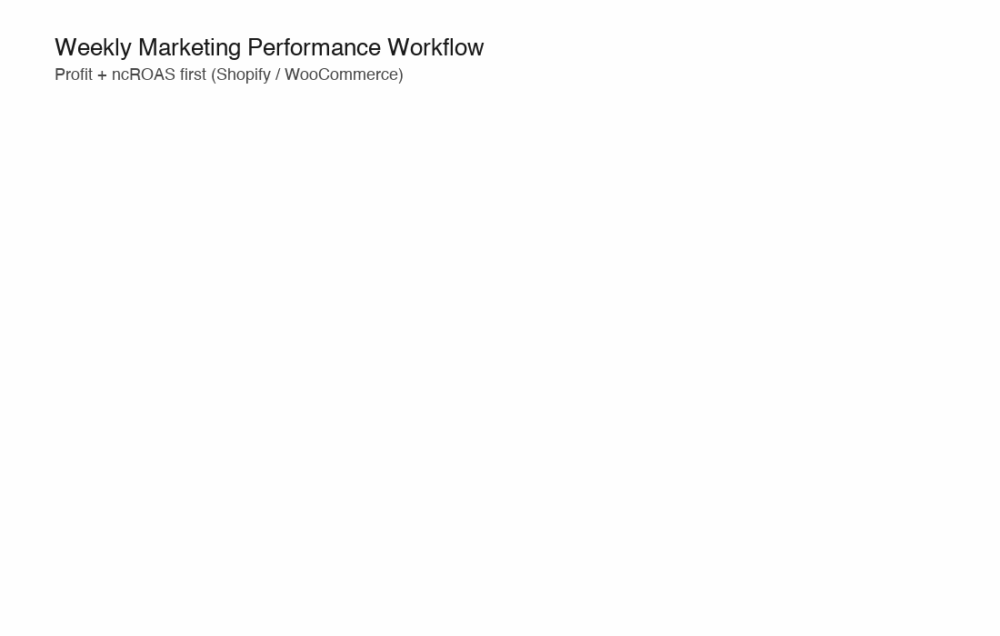

**English** | [简体中文](./README.zh-CN.md) | [日本語](./README.ja.md)

# 🛍️ Attribuly OpenClaw Skills: AI Marketing Analytics for Shopify & WooCommerce

Your specialized **AI Marketing Partner for DTC Ecommerce (Shopify, WooCommerce, and more)**. Powered by Attribuly's first-party data, these OpenClaw skills provide autonomous marketing analysis, true ROAS tracking, and profit-first optimization for your online store.

!\[GitHub stars]\(https\://img.shields.io/github/stars/attribuly/allyclaw-skills?style=social null)
!\[GitHub forks]\(https\://img.shields.io/github/forks/attribuly/allyclaw-skills?style=social null)
!\[Platform]\(https\://img.shields.io/badge/Platform-Shopify%20%7C%20WooCommerce-success null)

## 🚀 Get Started / 快速开始 / はじめに

**Get started:** Sign up and get your API key at <https://attribuly.com> (14-day free trial available).\
**快速开始:** 请前往 <https://attribuly.com> 注册获取 API Key（提供 14 天免费试用）。\
**はじめに:** <https://attribuly.com> でサインアップして API Key を取得してください（14日間の無料トライアルあり）。

### Why for Shopify & WooCommerce?

Traditional ad platforms (Meta, Google) often misattribute sales. For Shopify and WooCommerce merchants, these skills use your store's real backend data to reveal your **true profit margin, customer acquisition cost (CAC), and lifetime value (LTV)**, ensuring your marketing decisions are driven by actual revenue.

### Core Capabilities:

<div align="center">
  
</div>

- **True ROI & ROAS Focus** — Powered by Attribuly first-party attribution concepts (true ROAS, ncROAS, profit, margin, LTV, MER) to reduce Meta/Google over-attribution.
- **Under Your Control** — Deploy locally or in the cloud. Memory and strategy remain within your secure environment.
- **Extensible Skills** — Built-in automated triggers. Autonomously analyze funnels, pacing, creatives, and discrepancies. No lock-in.

### What you can do:

- **Diagnostic:** Autonomously detect funnel bottlenecks and landing page friction.
- **Performance:** Generate 30-second daily pacing scans or deep-dive weekly executive summaries.
- **Creative:** Evaluate Google/Meta creatives against true profitability and identify fatigue.
- **Optimization:** Get profit-first budget reallocation and audience tuning recommendations.

## 💬 Common Prompts / 常见触发词 / よくあるトリガー

Try asking the agent any of the following to trigger specific skills:

**English:**

- "How did we do last week? Generate a weekly report."
- "How's Google Ads doing?"
- "Where are users dropping off in the funnel?"
- "Where should I shift my spend? Optimize budget."
- "Analyze Google creatives and check for CTR issues."

**中文 (Chinese):**

- "上周表现如何？生成每周报告。"
- "Google广告表现如何？"
- "用户在转化漏斗的哪里流失了？"
- "我应该把预算转移到哪里？优化一下预算。"
- "分析Google素材并检查点击率问题。"

**日本語 (Japanese):**

- "先週のパフォーマンスはどうだった？週次レポートを作成して。"
- "Google広告の調子はどう？"
- "ユーザーはファネルのどこで離脱している？"
- "どこに予算を移すべき？予算を最適化して。"
- "Googleクリエイティブを分析してCTRの課題を確認して。"

***

## News & Changelog

**[2026-03-31] API Key Configuration Update!**
- **Simplified Setup**: Added auto-detect functionality for API Keys. Users can now simply paste their API Key directly in the chat, and the agent will automatically configure the `ATTRIBULY_API_KEY` environment variable.
- **Improved Interaction Flow**: Updated `SKILL.md` to prevent the agent from repeatedly asking for the API key once configured and added strict negative prompts (DO NOTs) to ensure the agent provides the registration link and handles the key securely.
- **Multi-language Support**: Updated setup instructions and agent responses across English, Chinese, and Japanese.

**[2026-03-22] We released v1.1.0!**

### \[v1.1.0] Added

- **Diagnostic Skills Suite**:
  - `funnel-analysis`: New skill to analyze end-to-end customer conversion funnels and identify specific drop-off bottlenecks by channel or landing page.
  - `landing-page-analysis`: New skill to diagnose landing-page conversion loss by analyzing stage progression, engagement quality, and traffic-source fit.
  - `attribution-discrepancy`: New skill to identify and diagnose reporting discrepancies between ad platform metrics (Meta/Google), Attribuly's unified attribution, and backend store data.
- **Creative Analysis Skills**:
  - `google-creative-analysis`: New skill to extract, process, and analyze creative performance data for Google Ads. Includes integration with Quality Score, PMax asset data, and standardized A/B testing protocols.

### \[v1.1.0] Changed

- **Skill Registry Updates**: Updated `SKILL_REGISTRY.md` to mark `funnel-analysis`, `landing-page-analysis`, `attribution-discrepancy`, and `google-creative-analysis` statuses from `🔜 Planned` to `✅ Ready`.
- **Attribution Discrepancy Flow Enhancements**:
  - Integrated Server-Side Tracking validation (`api/get/connection/destination`) to detect CAPI/pixel issues.
  - Upgraded logic to use the Full Impact Attribution model for Enterprise users to capture Meta view-through conversions.
  - Consolidated platform metric extraction to rely directly on Attribuly's unified `/api/all-attribution/get-list`.
- **Google Creative Analysis Consolidation**: Merged the standalone creative analysis framework (evaluation rubrics, DTC best practices, dashboard architecture) directly into the `google-creative-analysis` skill.

### \[v1.1.0] Removed

- Removed the outdated "Under-tracking" scenario from the `attribution-discrepancy` root cause analysis logic.
- Deleted the redundant standalone `creative_analysis_framework.md` file.

**\[Initial Release] v1.0.0**

- Initial creation of the `SKILL_REGISTRY.md` to map user intents to agent skills.
- Implemented core Performance Analysis Skills (`weekly_marketing_performance`, `daily_marketing_pulse`, `google_ads_performance`, `meta_ads_performance`).
- Implemented core Optimization Skills (`budget_optimization`, `audience_optimization`, `bid_strategy_optimization`).

***

## Table of Contents

- [Available Skills](#available-skills)
- [Installation Guide](#installation-guide)
- [Managed Cloud Hosting (Deployment)](#managed-cloud-hosting-deployment)
- [Post-Installation](#post-installation)

***

## Available Skills

### ✅ Ready (Available Now)

- `weekly-marketing-performance` — Cross-channel weekly executive summary
- `daily-marketing-pulse` — Daily anomaly detection & pacing (30-sec scan)
- `google-ads-performance` — Deep dive into Google Ads / PMax efficiency
- `meta-ads-performance` — Deep dive into Meta Ads (bridge iOS14 data gap)
- `budget-optimization` — Profit-first budget reallocation rules
- `audience-optimization` — Audience overlap and acquisition/retargeting split
- `bid-strategy-optimization` — tCPA/tROAS targeting based on first-party data
- `funnel-analysis` — End-to-end customer journey drop-off diagnosis
- `landing-page-analysis` — Isolate traffic quality vs UX friction on landing pages
- `attribution-discrepancy` — Quantify and diagnose reporting gaps between ad networks and backend
- `google-creative-analysis` — Integrate Quality Score, PMax assets, and standardized evaluation rubrics for Google Ads

### 🔜 Coming Soon (Planned)

- `tiktok-ads-performance`
- `meta-creative-analysis`
- `creative-fatigue-detector`
- `product-performance`
- `customer-journey-analysis`
- `ltv-analysis`

See [SKILL\_REGISTRY.md](SKILL_REGISTRY.md) for detailed triggers and usage mapping.

***

## Installation Guide

### 🚀 No-Code Setup for Shopify & WooCommerce Users

Not a developer? No problem! You can run these AI skills without writing any code:

1. Connect your Shopify or WooCommerce store to [Attribuly](https://attribuly.com).
2. Grab your API Key from the Attribuly dashboard.
3. Paste the key into your Agent Settings
4. Ask the AI: *"Analyze my Shopify funnel drop-off for the last 7 days."*

### Step 1: Obtain Your Attribuly API Key

Before installing the skills, you need an Attribuly API key. These skills rely heavily on Attribuly-exclusive metrics (like `new_order_roas` and true profit) to function autonomously.

- **Paid Feature:** The API key is exclusively available to paid-plan users. You must upgrade your workspace before you can generate the key.
- **Free Trial:** If you are new, you can start a [14-day free trial](https://attribuly.com/pricing/) to test the platform.
- **How to configure:** Once acquired, simply **paste the API Key directly in the chat** with the Agent. The Agent will automatically and securely configure it for you.

***

There are two primary ways to install these Attribuly skills into your own OpenClaw environment. Choose the method that best fits your workflow.

### Step 2: Install via chat (Quick Start)

Copy the prompt below into your OpenClaw interface, and the agent will install it for you:

> Install these skills from <https://github.com/Alexchulee/Attribuly-DTC-skills-openclaw.git>

### Step 2: Git Submodule (Recommended for Easy Updates)

If you want to keep your skills up-to-date with the latest improvements from this repository, adding it as a Git submodule is the best approach.

1. Navigate to the root of your OpenClaw instance in your terminal.
2. Add this repository as a submodule:
   ```bash
   git submodule add https://github.com/Alexchulee/Attribuly.git vendor/attribuly
   ```
3. Create the skills directory if it doesn't already exist:
   ```bash
   mkdir -p ./openclaw-config/skills
   ```
4. Sync the skill bundle into your active configuration:
   ```bash
   rsync -av --exclude=".*" --exclude="LICENSE" vendor/attribuly/ ./openclaw-config/skills/attribuly-dtc-analyst/
   ```

**How to pull future updates:**
To ensure you always have the latest skill logic, you can easily pull updates and re-sync them:

```bash
git submodule update --remote --merge
rsync -av --exclude=".*" --exclude="LICENSE" vendor/attribuly/ ./openclaw-config/skills/attribuly-dtc-analyst/
```

### Step 3: Initialize Agent Role (Rule & Soul)

To ensure the agent behaves as an expert DTC Growth Partner, you need to configure its core identity. OpenClaw automatically injects workspace bootstrap files into its system prompt.

**Automated Method (Recommended):**
Copy the role prompt directly into your agent's workspace as `SOUL.md` (or append to it if it exists):

```bash
cp vendor/attribuly/role_prompt.md ./openclaw-config/SOUL.md
```

*(If you are using a specific multi-agent setup, copy it to* *`~/.openclaw/agents/<your-agent-name>/agent.md`)*

**Manual Method (Chat Interface):**

1. Open the [`role_prompt.md`](role_prompt.md) file in this repository.
2. Copy the entire content of the file.
3. Paste it into your OpenClaw chat/dialog box to initialize the agent's rules, soul, and persona.

***

## Managed Cloud Hosting (Deployment)

If you do not want to run OpenClaw locally and prefer an always-on, fully managed environment to run your Attribuly skills and LLMs, we recommend using **ModelScope Cloud Hosting** or **AWS Bedrock / SageMaker**.

> **Important**: Access to the fully managed cloud environment is currently rolling out in phases. Please complete the [Join AllyClaw Waitlist form](https://attribuly.sg.larksuite.com/share/base/form/shrlgSK0KaktsDwbTJqPkjDczCd) to request priority access.

## Post-Installation

Once the skill bundle is successfully placed in your `openclaw-config/skills/` directory (locally or in the cloud), check the [SKILL\_REGISTRY.md](SKILL_REGISTRY.md) for details on the specific triggers and required contexts to use each capability effectively.
