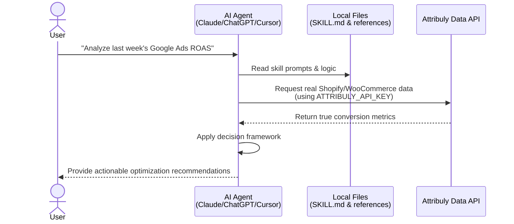
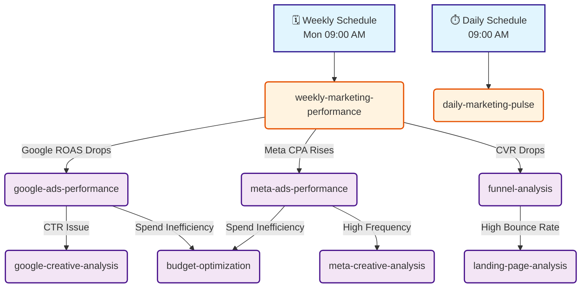

**English** | [简体中文](./README.zh-CN.md) | [日本語](./README.ja.md)

# 🛍️ Attribuly AI Marketing Skills: Universal Analyst for ChatGPT, Claude, Codex & OpenClaw

[Watch the video](https://youtu.be/JDat6bls5Wk?si=jgZtnRZnl39VqFj3)

<br />

Your specialized **AI Marketing Partner for DTC Ecommerce (Shopify, WooCommerce, and more)**. Powered by Attribuly's first-party data, these **Shopify Data Analytics** skills provide autonomous marketing analysis, true ROAS tracking, and profit-first optimization for your online store using a robust **ChatGPT Marketing Prompt** framework and API logic.

## 🚀 How It Works (Workflow)



### Autonomous Diagnostics & Skill Chaining

By setting up scheduled tasks (daily/weekly) or metric alerts, the skills can autonomously chain together to perform deep root-cause analysis:



### Why for Shopify & WooCommerce?

The main challenge for AI in marketing isn't just misattribution—it's that general AI lacks the full context from the initial ad click all the way to the final purchase. Traditional ad platforms (Meta, Google) only see their own fragmented pieces of the journey. For Shopify and WooCommerce merchants, these skills bridge that gap by using your store's real backend data. This provides the AI with the complete, end-to-end customer journey needed to reveal your **true profit margin, customer acquisition cost (CAC), and lifetime value (LTV)**, ensuring its marketing diagnoses and decisions are driven by actual revenue context.

### Core Capabilities:

<br />

- **True ROI & ROAS Focus** — Powered by Attribuly first-party attribution concepts (true ROAS, ncROAS, profit, margin, LTV, MER) to reduce Meta/Google over-attribution.
- **Universal Compatibility** — Works with any AI agent capable of file reading and API calls (ChatGPT, Claude Code, Cursor, Trae, OpenClaw).
- **Extensible Skills** — Built-in automated triggers. Autonomously analyze funnels, pacing, creatives, and discrepancies. No lock-in.

### What you can do:

- **Diagnostic:** Autonomously detect funnel bottlenecks and landing page friction.
- **Performance:** Generate 30-second daily pacing scans or deep-dive weekly executive summaries.
- **Creative:** Evaluate Google/Meta creatives against true profitability and identify fatigue.
- **Optimization:** Get profit-first budget reallocation and audience tuning recommendations.

## 💬 Common Prompts / 常见触发词 / よくあるトリガー

Try asking the agent any of the following to trigger specific skills:

**English:**

- "How did we do last week? Generate a weekly report."
- "How's Google Ads doing?"
- "Where are users dropping off in the funnel?"
- "Where should I shift my spend? Optimize budget."
- "Analyze Google creatives and check for CTR issues."

**中文 (Chinese):**

- "上周表现如何？生成每周报告。"
- "Google广告表现如何？"
- "用户在转化漏斗的哪里流失了？"
- "我应该把预算转移到哪里？优化一下预算。"
- "分析Google素材并检查点击率问题。"

**日本語 (Japanese):**

- "先週のパフォーマンスはどうだった？週次レポートを作成して。"
- "Google広告の調子はどう？"
- "ユーザーはファネルのどこで離脱している？"
- "どこに予算を移すべき？予算を最適化して。"
- "Googleクリエイティブを分析してCTRの課題を確認して。"

***

## Table of Contents

- [Available Skills](#available-skills)
- [How to Use with Other AI Agents (Installation)](#how-to-use-with-other-ai-agents-installation)
- [Managed Cloud Hosting (Deployment)](#managed-cloud-hosting-deployment)
- [Technical Reference](#technical-reference)

***

## Available Skills

### ✅ Ready (Available Now)

- `weekly-marketing-performance` — Cross-channel weekly executive summary
- `daily-marketing-pulse` — Daily anomaly detection & pacing (30-sec scan)
- `google-ads-performance` — Deep dive into Google Ads / PMax efficiency
- `meta-ads-performance` — Deep dive into Meta Ads (bridge iOS14 data gap)
- `budget-optimization` — Profit-first budget reallocation rules
- `audience-optimization` — Audience overlap and acquisition/retargeting split
- `bid-strategy-optimization` — tCPA/tROAS targeting based on first-party data
- `funnel-analysis` — End-to-end customer journey drop-off diagnosis
- `landing-page-analysis` — Isolate traffic quality vs UX friction on landing pages
- `attribution-discrepancy` — Quantify and diagnose reporting gaps between ad networks and backend
- `google-creative-analysis` — Integrate Quality Score, PMax assets, and standardized evaluation rubrics for Google Ads
- `meta-creative-analysis` — Analyze video engagement, creative placement performance, and detect creative fatigue for Meta Ads

### 🔜 Coming Soon (Planned)

- `tiktok-ads-performance`
- `creative-fatigue-detector`
- `product-performance`
- `customer-journey-analysis`
- `ltv-analysis`

See the Technical Reference section below for detailed triggers and usage mapping.

\---\*\*\*

## How to Use with Other AI Agents (Installation)

This repository contains structured prompts (`SKILL.md`) and logic definitions (`references/`). **Any LLM tool capable of file reading and API requests can use these skills natively.**

### ⚠️ Prerequisite: Attribuly API Key (Required)

Before installing the skills, you need an Attribuly API key. These skills rely heavily on Attribuly-exclusive metrics (like `new_order_roas` and true profit) to function autonomously. Regular AI models lack access to your real order data; our API bridges this gap.

- **Data Privacy**: When running this via a local agent (like Claude Code or Cursor), your data analysis happens entirely on your local machine. The API only fetches aggregated metrics, ensuring your core business data remains secure and private.
- **How to get your API key:**
  1. Connect your Shopify or WooCommerce store to [Attribuly](https://attribuly.com) (14-day free trial available).
  2. Navigate to Settings → API Keys in your dashboard.
  3. Copy your API key (it should look like `att_xxxxxxxxxxxx`).

### Option 1: CLI AI Agents (Claude Code, Cursor, Trae, Codex)

1. **Clone the repository:**
   ```bash
   git clone https://github.com/Attribuly-US/ecommerce-dtc-skills.git
   cd ecommerce-dtc-skills
   ```
2. **Set your API Key as an environment variable:**
   ```bash
   export ATTRIBULY_API_KEY="att_your_actual_key"
   ```
3. **Run your agent in the directory and prompt it:**
   ```bash
   claude -p "Read SKILL.md and generate a weekly marketing report for my store"
   ```

### Option 2: ChatGPT (Custom GPTs / Web)

1. Download the `references/` directory and upload the Markdown files as a **Knowledge Base** to your Custom GPT.
2. Copy the system prompt instructions from `SKILL.md` into your GPT's **Instructions** field.
3. Configure an **Action** using the Attribuly API endpoints described in the references, and authenticate with your API Key in the Action settings.

### Option 3: OpenClaw (Native Support)

For OpenClaw users, you can deploy it directly via the terminal:

1. **Set the API Key:**
   ```bash
   openclaw config set skills.entries.attribuly-dtc-analyst.env.ATTRIBULY_API_KEY "att_your_actual_key"
   ```
2. **Restart the Gateway:**
   ```bash
   openclaw gateway restart
   ```
3. **Install via ClawHub:**
   OpenClaw users can directly install the skill using the `clawhub` command:
   ```bash
   openclaw install https://clawhub.ai/alexchulee/attribuly
   ```

***

# Managed Cloud Hosting (AllyClaw)

| Feature               | Local Deployment (Open Source)                            | Cloud Version (Attribuly Managed)                                                |
| :-------------------- | :-------------------------------------------------------- | :------------------------------------------------------------------------------- |
| **Best For**          | Geek teams, Developers                                    | DTC Merchants, Marketers, Non-technical teams                                    |
| **Cost**              | Free                                                      | $20/month (50% off first month)                                                  |
| **Setup**             | Requires self-hosting, API config & environment tinkering | 1-minute out-of-the-box, Zero code required                                      |
| **Maintenance**       | Manual updates, Self-maintained                           | Auto-updates, Zero maintenance                                                   |
| **Core Advantage**    | Basic LLM invocation                                      | Intelligent multi-LLM orchestration, Operational management, Enterprise security |
| **Advanced Features** | None                                                      | Organizational Long-term Memory (Coming soon)                                    |

If you want to eliminate technical hassles and focus entirely on your marketing data, we highly recommend clicking the **Deploy to Attribuly Cloud** button at the top to start your cloud trial.

***

## Technical Reference

### Skill Trigger Matrix

#### Automatic Triggers

> **Note on Automation:** To achieve these automatic triggers, you must manually create scheduled tasks (such as cron jobs) or use the scheduling feature within your chosen AI agent platform to execute the corresponding prompts at the specified times or when specific metric thresholds are crossed.

| Condition              | Triggered Skill                                     | Priority |
| :--------------------- | :-------------------------------------------------- | :------- |
| Monday 09:00 AM        | `weekly-marketing-performance`                      | High     |
| Daily 09:00 AM         | `daily-marketing-pulse`                             | Medium   |
| ROAS drops >20%        | `weekly-marketing-performance` + channel drill-down | Critical |
| CPA increases >20%     | Channel-specific performance skill                  | High     |
| CTR drops >15%         | `creative-fatigue-detector`                         | Medium   |
| CVR drops >15%         | `funnel-analysis`                                   | High     |
| Spend >30% over budget | `budget-optimization`                               | Critical |

### Global API Parameters

These defaults apply to ALL skills unless overridden:

| Parameter   | Default Value | Notes                                                          |
| :---------- | :------------ | :------------------------------------------------------------- |
| `model`     | `linear`      | Linear attribution                                             |
| `goal`      | `purchase`    | Purchase conversions (use dynamic goal code from Settings API) |
| `version`   | `v2-4-2`      | API version                                                    |
| `page_size` | `100`         | Max records per page                                           |

**Base URL:** `https://data.api.attribuly.com`
**Authentication:** `ApiKey` header (Read from `ATTRIBULY_API_KEY` Environment Variable / Secret Manager. NEVER ask the user for this in chat.)

### Decision Framework: Compare Platform vs. Attribuly Metrics

| Scenario       | Platform ROAS | Attribuly ROAS | Diagnosis                                            | Action                                                    |
| :------------- | :------------ | :------------- | :--------------------------------------------------- | :-------------------------------------------------------- |
| Hidden Gem     | Low (<1.5)    | High (>2.5)    | Top-of-funnel driver undervalued by platform         | **DO NOT PAUSE.** Tag as "TOFU Driver." Consider scaling. |
| Hollow Victory | High (>3.0)   | Low (<1.5)     | Platform over-attributing (likely brand/retargeting) | **CAP BUDGET.** Investigate incrementality.               |
| True Winner    | High (>2.5)   | High (>2.5)    | Genuine high performer                               | **SCALE.** Increase budget 20% every 3-5 days.            |
| True Loser     | Low (<1.0)    | Low (<1.0)     | Inefficient spend                                    | **PAUSE or REDUCE.** Refresh creative or audience.        |

### Key Metrics Glossary

| Metric         | Formula                                          | Description                          |
| :------------- | :----------------------------------------------- | :----------------------------------- |
| **ROAS**       | `conversion_value / spend`                       | Attribuly-tracked Return on Ad Spend |
| **ncROAS**     | `ncPurchase / spend`                             | New Customer ROAS                    |
| **MER**        | `total_revenue / total_spend`                    | Marketing Efficiency Ratio           |
| **CPA**        | `spend / conversions`                            | Cost Per Acquisition                 |
| **CPC**        | `spend / clicks`                                 | Cost Per Click                       |
| **CPM**        | `(spend / impressions) * 1000`                   | Cost Per 1000 Impressions            |
| **CTR**        | `(clicks / impressions) * 100%`                  | Click-Through Rate                   |
| **CVR**        | `(conversions / clicks) * 100%`                  | Conversion Rate                      |
| **LTV**        | `total_sales / unique_customers`                 | Lifetime Value                       |
| **Net Profit** | `sales - shipping - spend - COGS - taxes - fees` | True Profit                          |
| **Net Margin** | `net_profit / sales * 100%`                      | Profit Margin                        |

