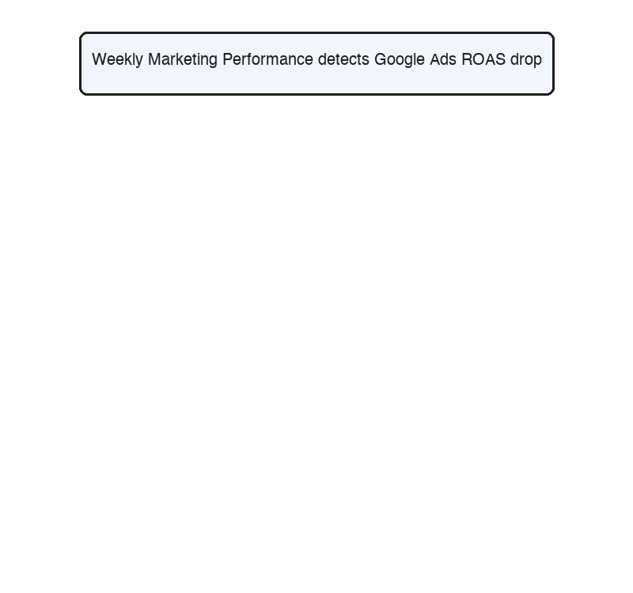

[English](./README.md) | **简体中文** | [日本語](./README.ja.md)

# 🛍️ Attribuly OpenClaw 技能库：专为 Shopify 与 WooCommerce 打造的 AI 营销分析助手

您的 **DTC 电商专属 AI 营销合作伙伴 (支持 Shopify, WooCommerce 等独立站平台)**。由 Attribuly 第一方数据驱动，这些 OpenClaw 技能为您提供自动化的营销诊断、真实 ROAS 追踪以及利润优先的广告优化建议。


> **全自动营销诊断工作流展示：**
> 
> 下面的动画展示了我们的 AI 技能是如何自动串联、逐步深挖性能问题的。例如，当每周报告检测到 Google Ads ROAS 下降时，它会自动触发深度诊断，检查点击率（CTR）问题，并在必要时进一步下钻到具体创意素材层级进行分析。
> 
> <div align="center">
>   
> </div>

### 为什么适合 Shopify & WooCommerce 商家？
传统的广告平台（如 Meta、Google）经常存在数据归因偏差。对于 Shopify 和 WooCommerce 卖家，这些 AI 技能会直接打通您的店铺后台真实订单数据，为您揭示**真实的利润率、客户获取成本 (CAC) 以及用户生命周期价值 (LTV)**，让营销决策有据可依。

### 核心能力：
- **聚焦真实 ROI 与 ROAS** — 基于 Attribuly 第一方归因概念（真实 ROAS、新客 ROAS、利润、利润率、LTV、MER），减少 Meta/Google 广告平台的过度归因。
- **完全可控** — 支持本地或云端部署。您的记忆和策略数据始终保留在安全的专属环境中。
- **可扩展的技能** — 内置自动化触发器。自主分析转化漏斗、预算消耗节奏、创意素材表现及数据差异。无平台绑定。

### 核心使用场景：
- **诊断分析:** 自动检测漏斗瓶颈与落地页转化摩擦。
- **业绩追踪:** 生成 30 秒每日消耗扫描报告或深度的每周高管摘要。
- **创意优化:** 基于真实利润评估 Google/Meta 创意素材，并识别素材疲劳。
- **预算调优:** 获取以利润为先的预算重分配和受众调整建议。

---

## 最新动态与更新日志

**[2026-03-31] API Key 配置流程全面优化！**
- **极简配置体验**: 新增 API Key 自动检测功能。用户现在只需在对话框中直接粘贴 API Key，Agent 便会自动执行命令完成环境变量的配置。
- **更智能的交互逻辑**: 更新了 `SKILL.md`，加入了严格的负面约束（DO NOTs），确保 Agent 在缺少 Key 时必定提供注册链接，且不会重复索要或回显敏感信息。
- **多语言全覆盖**: 自动配置的提示语及相关文档指南已全面适配中文、英文和日文。

**[2026-03-22] v1.1.0 版本正式发布！** 

### [v1.1.0] 新增
- **诊断分析技能套件**: 
  - `funnel-analysis`: 全链路客户转化漏斗分析，精确定位各渠道或落地页的流失瓶颈。
  - `landing-page-analysis`: 诊断落地页转化流失，区分流量质量问题与用户体验摩擦。
  - `attribution-discrepancy`: 识别并诊断广告平台指标（Meta/Google）、Attribuly 统一归因和后端商店数据之间的报告差异。
- **创意分析技能**:
  - `google-creative-analysis`: 提取、处理并分析 Google Ads 的创意表现数据，集成了质量得分、PMax 资产数据及标准化的 A/B 测试评估协议。

### [v1.1.0] 变更
- **技能注册表更新**: 更新了 `SKILL_REGISTRY.md`，将 `funnel-analysis`, `landing-page-analysis`, `attribution-discrepancy`, 和 `google-creative-analysis` 的状态从 `🔜 Planned` 修改为 `✅ Ready`。
- **Google Ads Performance**: 增强了深度的根本原因细分逻辑，当检测到 CTR 问题时，可直接映射触发新的 `google-creative-analysis` 技能。
- **Weekly Marketing Performance**: 整合了漏斗健康检查，并添加了在 CVR 下降时调用新 `funnel-analysis` 技能的触发条件。
- **Meta Ads Performance**: 更新了数据获取的 schema，以包含与新归因管道兼容的标准化参数。
- **Google Creative Analysis 整合**: 将独立的创意分析框架（评估标准、DTC 最佳实践、仪表板架构）直接合并到 `google-creative-analysis` 技能中。

### [v1.1.0] 移除
- 从 `attribution-discrepancy` 的根本原因分析逻辑中删除了过时的“跟踪不足 (Under-tracking)”场景。
- 删除了冗余的独立文件 `creative_analysis_framework.md`。

**[首次发布] v1.0.0**
- 首次创建 `SKILL_REGISTRY.md` 以映射用户意图与 Agent 技能。
- 实现核心业绩分析技能 (`weekly_marketing_performance`, `daily_marketing_pulse`, `google_ads_performance`, `meta_ads_performance`)。
- 实现核心优化技能 (`budget_optimization`, `audience_optimization`, `bid_strategy_optimization`)。

---

## 目录

- [可用技能列表](#可用技能列表)
- [安装指南](#安装指南)
- [全托管云部署](#全托管云部署)
- [安装后配置](#安装后配置)

---

## 可用技能列表

### ✅ 可用 (Ready)

- `weekly-marketing-performance` — 跨渠道每周高管摘要
- `daily-marketing-pulse` — 每日异常检测与预算消耗报告 (30秒极速扫描)
- `google-ads-performance` — Google Ads / PMax 业绩诊断
- `meta-ads-performance` — Meta Ads 业绩诊断 (填补 iOS14 数据鸿沟)
- `budget-optimization` — 利润优先的预算重分配建议
- `audience-optimization` — 受众重叠分析与拉新/重定向调优
- `bid-strategy-optimization` — 基于第一方数据的 tCPA/tROAS 目标设定
- `funnel-analysis` — 客户全生命周期漏斗流失诊断
- `landing-page-analysis` — 识别落地页的流量质量与 UX 摩擦
- `attribution-discrepancy` — 量化并诊断广告网络与后端系统间的报告差异
- `google-creative-analysis` — Google Ads 创意质量得分、PMax 资产及标准化评估

### 🔜 计划中 (Coming Soon)

- `tiktok-ads-performance`
- `meta-creative-analysis`
- `creative-fatigue-detector`
- `product-performance`
- `customer-journey-analysis`
- `ltv-analysis`

有关触发条件和使用映射的详细信息，请参阅底部的 **技术参考 (Technical Reference)** 章节。

---

## 安装指南

### 🚀 Shopify & WooCommerce 用户免代码快速配置指南
不懂代码？完全没问题！您可以通过以下免代码方式运行这些 AI 技能：
1. 将您的 Shopify 或 WooCommerce 店铺连接到 [Attribuly](https://attribuly.com)。
2. 从 Attribuly 后台获取您的 API 密钥 (API Key)。
3. 在您的 OpenClaw Agent 设置中，将该密钥粘贴到 `ATTRIBULY_API_KEY` 环境变量下。
4. 直接向 AI 提问：*"帮我分析一下过去 7 天我 Shopify 店铺的漏斗流失情况。"*

### 步骤 0：获取您的 Attribuly API 密钥

在安装技能之前，您需要获取一个 Attribuly API 密钥。这些技能高度依赖 Attribuly 独有的指标（如 `new_order_roas` 和真实利润）来实现自动化分析。

- **付费专属功能：** API 密钥仅对付费计划用户开放。您必须升级您的工作空间才能生成密钥。
- **免费试用：** 如果您是新用户，可以开启 [14天免费试用](https://attribuly.com/pricing/) 来体验平台功能。
- **如何配置：** 获取密钥后，只需**直接在聊天对话框中将 API Key 发送给 Agent**，Agent 会自动且安全地为您完成配置。

---

您可以通过两种主要方式将这些 Attribuly 技能安装到您的 OpenClaw 环境中。请选择最适合您工作流的方法。

### 方法 1：通过对话安装 (快速开始)

将以下提示词复制到您的 OpenClaw 对话框中，Agent 将自动为您安装：

> Install these skills from https\://github.com/Alexchulee/Attribuly-DTC-skills-openclaw\.git

### 方法 2：Git Submodule (推荐，便于更新)

如果您希望始终保持技能库为最新版本，添加 Git 子模块是最佳方案。

1. 在终端中导航到您的 OpenClaw 实例根目录。
2. 将此仓库添加为子模块：
   ```bash
   git submodule add https://github.com/Alexchulee/Attribuly.git vendor/attribuly
   ```
3. 如果 `skills` 目录不存在，请先创建：
   ```bash
   mkdir -p ./openclaw-config/skills
   ```
4. 将技能文件夹同步到您的活动配置目录：
   ```bash
   rsync -av --exclude=".*" --exclude="LICENSE" vendor/attribuly/ ./openclaw-config/skills/attribuly-dtc-analyst/
   ```

**如何拉取后续更新：**
为确保您始终使用最新的技能逻辑，您可以轻松拉取更新并重新同步：

```bash
git submodule update --remote --merge
rsync -av --exclude=".*" --exclude="LICENSE" vendor/attribuly/ ./openclaw-config/skills/attribuly-dtc-analyst/
```

### 步骤 3：初始化 Agent 角色 (Rule & Soul)

为了确保 Agent 表现得像一个专业的 DTC 增长伙伴，您需要配置其核心身份。OpenClaw 会自动将工作区引导文件（bootstrap files）注入到其系统提示词中。

**自动化方法（推荐）：**
直接将角色提示词复制到您的 Agent 工作区并命名为 `SOUL.md`（如果文件已存在则追加）：
```bash
cp vendor/attribuly/role_prompt.md ./openclaw-config/SOUL.md
```
*(如果您使用的是特定的多智能体设置，请将其复制到 `~/.openclaw/agents/<您的agent名称>/agent.md`)*

**手动方法（通过对话框）：**
1. 打开此仓库中的 [`role_prompt.md`](role_prompt.md) 文件。
2. 复制文件的全部内容。
3. 将其粘贴到您的 OpenClaw 聊天/对话框中，以初始化 Agent 的规则、灵魂和角色。

---

## 全托管云部署

如果您不想在本地运行 OpenClaw，而是更倾向于使用 24 小时在线的全托管环境来运行您的 Attribuly 技能和 LLM，我们推荐使用 **ModelScope Cloud Hosting (魔搭社区云托管)** 或 **AWS Bedrock / SageMaker**。

> **重要提示**：全托管云环境的访问权限目前正在分阶段推出。请填写 [加入 AllyClaw 候补名单表单](https://attribuly.sg.larksuite.com/share/base/form/shrlgSK0KaktsDwbTJqPkjDczCd) 以申请优先访问权。您必须是 Attribuly 的付费用户才有资格申请。

---

## 安装后配置

一旦技能包成功放置在您的 `openclaw-config/skills/` 目录中（本地或云端），请参阅下方的 **技术参考 (Technical Reference)** 以获取有关特定触发器、技能链逻辑和全局 API 参数的详细信息。

---

## 技术参考 (Technical Reference)

### 技能触发矩阵 (Skill Trigger Matrix)

#### 自动触发条件 (Automatic Triggers)

| 条件 (Condition) | 触发的技能 (Triggered Skill) | 优先级 (Priority) |
| :--- | :--- | :--- |
| 每周一 09:00 AM | `weekly-marketing-performance` | 高 (High) |
| 每日 09:00 AM | `daily-marketing-pulse` | 中 (Medium) |
| ROAS 下降 >20% | `weekly-marketing-performance` + 渠道下钻 | 极高 (Critical) |
| CPA 上升 >20% | 渠道专属业绩技能 | 高 (High) |
| CTR 下降 >15% | `creative-fatigue-detector` | 中 (Medium) |
| CVR 下降 >15% | `funnel-analysis` | 高 (High) |
| 消耗超出预算 >30% | `budget-optimization` | 极高 (Critical) |

### 技能链逻辑 (Skill Chaining Logic)

当一个技能检测到问题时，它可以触发相关的下级技能：

```text
weekly-marketing-performance
├── IF Google Ads issue detected → google-ads-performance
│   └── IF CTR issue → google-creative-analysis
├── IF Meta Ads issue detected → meta-ads-performance
│   └── IF frequency high → meta-creative-analysis
├── IF CVR issue detected → funnel-analysis
│   └── IF landing page issue → landing-page-analysis
└── IF budget inefficiency → budget-optimization
```

### 全局 API 参数 (Global API Parameters)

这些默认值适用于所有技能（除非在特定技能中被覆盖）：

| 参数 | 默认值 | 备注 |
| :--- | :--- | :--- |
| `model` | `linear` | 线性归因 (Linear attribution) |
| `goal` | `purchase` | 购买转化 (使用 Settings API 获取的动态目标代码) |
| `version` | `v2-4-2` | API 版本 |
| `page_size` | `100` | 每页最大记录数 |

**Base URL:** `https://data.api.attribuly.com`
**Authentication:** `ApiKey` 请求头 (从 `ATTRIBULY_API_KEY` 环境变量读取。**绝对不要在聊天中向用户索要此密钥。**)
