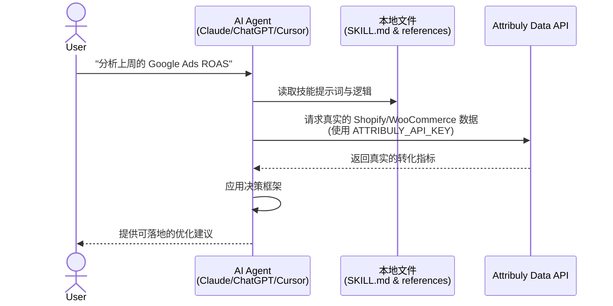
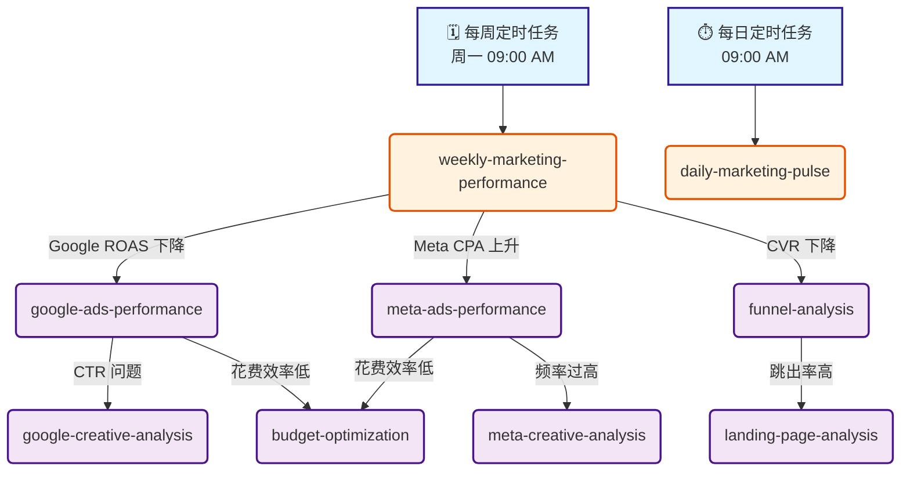

[English](./README.md) | **简体中文** | [日本語](./README.ja.md)

# 🛍️ Attribuly AI 营销分析技能库：支持 ChatGPT, Claude, Codex 与 OpenClaw 的通用电商助手

您的 **DTC 电商专属 AI 营销合作伙伴 (支持 Shopify, WooCommerce 等独立站平台)**。由 Attribuly 第一方数据驱动，这些 **AI 营销 Agent** 技能为您提供自动化的营销诊断、真实 ROAS 追踪以及利润优先的广告优化建议。通过 **ChatGPT 营销提示词**框架和 API 逻辑，打造强大的 **Shopify 数据分析**体验。

## 🚀 工作原理 (Workflow)



### 自动化诊断与技能串联 (Autonomous Diagnostics & Skill Chaining)

通过设置定时任务（每日/每周）或指标警报，这些技能可以自动串联，执行深度的根因分析：



### 为什么适合 Shopify & WooCommerce 商家？

AI 在营销中面临的主要挑战不仅仅是错误归因——而是**通用的 AI 缺乏从最初的广告点击到最终购买的完整上下文（Full Context）**。传统的广告平台（如 Meta、Google）只能看到各自支离破碎的旅程片段。对于 Shopify 和 WooCommerce 卖家，这些 AI 技能会直接打通您的店铺后台真实订单数据。这为 AI 提供了端到端的完整用户旅程，从而揭示**真实的利润率、客户获取成本 (CAC) 以及用户生命周期价值 (LTV)**，确保其营销诊断和决策完全基于真实的收入上下文。

### 核心能力：
- **聚焦真实 ROI 与 ROAS** — 基于 Attribuly 第一方归因概念（真实 ROAS、新客 ROAS、利润、利润率、LTV、MER），减少 Meta/Google 广告平台的过度归因。
- **通用兼容性** — 支持任何具备文件读取和 API 调用能力的 AI Agent（如 ChatGPT、Claude Code、Cursor、Trae、OpenClaw）。
- **可扩展的技能** — 内置自动化触发器。自主分析转化漏斗、预算消耗节奏、创意素材表现及数据差异。无平台绑定。

### 核心使用场景：
- **诊断分析:** 自动检测漏斗瓶颈与落地页转化摩擦。
- **业绩追踪:** 生成 30 秒每日消耗扫描报告或深度的每周高管摘要。
- **创意优化:** 基于真实利润评估 Google/Meta 创意素材，并识别素材疲劳。
- **预算调优:** 获取以利润为先的预算重分配和受众调整建议。

---

## 目录

- [可用技能列表](#可用技能列表)
- [如何与其他 AI Agent 配合使用 (安装指南)](#如何与其他-ai-agent-配合使用-安装指南)
- [全托管云部署](#全托管云部署)
- [技术参考 (Technical Reference)](#技术参考-technical-reference)

---

## 可用技能列表

### ✅ 可用 (Ready)

- `weekly-marketing-performance` — 跨渠道每周高管摘要
- `daily-marketing-pulse` — 每日异常检测与预算消耗报告 (30秒极速扫描)
- `google-ads-performance` — Google Ads / PMax 业绩诊断
- `meta-ads-performance` — Meta Ads 业绩诊断 (填补 iOS14 数据鸿沟)
- `budget-optimization` — 利润优先的预算重分配建议
- `audience-optimization` — 受众重叠分析与拉新/重定向调优
- `bid-strategy-optimization` — 基于第一方数据的 tCPA/tROAS 目标设定
- `funnel-analysis` — 客户全生命周期漏斗流失诊断
- `landing-page-analysis` — 识别落地页的流量质量与 UX 摩擦
- `attribution-discrepancy` — 量化并诊断广告网络与后端系统间的报告差异
- `google-creative-analysis` — Google Ads 创意质量得分、PMax 资产及标准化评估
- `meta-creative-analysis` — 分析 Meta 广告的视频参与度、创意展示位置表现并检测素材疲劳

### 🔜 计划中 (Coming Soon)

- `tiktok-ads-performance`
- `creative-fatigue-detector`
- `product-performance`
- `customer-journey-analysis`
- `ltv-analysis`

有关触发条件和使用映射的详细信息，请参阅底部的 **技术参考 (Technical Reference)** 章节。

---

## 如何与其他 AI Agent 配合使用 (安装指南)

本仓库包含结构化的提示词 (`SKILL.md`) 和逻辑定义 (`references/`)。**任何具备文件读取和 API 请求能力的 LLM 工具都可以原生使用这些技能。**

### ⚠️ 前置条件：Attribuly API 密钥（必须）

在安装技能之前，您需要获取一个 Attribuly API 密钥。这些技能高度依赖 Attribuly 独有的指标（如 `new_order_roas` 和真实利润）来实现自动化分析。常规的 AI 模型无法获取您的真实订单数据；我们的 API 填补了这一空白。

- **数据隐私**：当通过本地 Agent（如 Claude Code 或 Cursor）运行此技能时，数据分析完全在您的本地机器上进行。API 仅拉取聚合指标，确保您的核心业务数据安全私密。
- **如何获取 API 密钥：**
  1. 将您的 Shopify 或 WooCommerce 店铺连接到 [Attribuly](https://attribuly.com)（提供 14 天免费试用）。
  2. 登录后，进入仪表板的 Settings → API Keys。
  3. 复制您的 API 密钥（格式类似 `att_xxxxxxxxxxxx`）。

### 方式 1：CLI 开发助手 (Claude Code, Cursor, Trae, Codex)

1. **克隆本仓库：**
   ```bash
   git clone https://github.com/Attribuly-US/ecommerce-dtc-skills.git
   cd ecommerce-dtc-skills
   ```
2. **设置 API Key 环境变量：**
   ```bash
   export ATTRIBULY_API_KEY="att_your_actual_key"
   ```
3. **在当前目录运行您的 Agent 并提问：**
   ```bash
   claude -p "Read SKILL.md and generate a weekly marketing report for my store"
   ```

### 方式 2：ChatGPT (Custom GPTs / 网页版)

1. 下载 `references/` 目录，并将这些 Markdown 文件作为**知识库 (Knowledge Base)** 上传到您的 Custom GPT。
2. 将 `SKILL.md` 中的系统提示词说明复制到 GPT 的 **Instructions** 字段中。
3. 参考文件描述配置一个 **Action** 来调用 Attribuly API 端点，并在 Action 设置中使用您的 API Key 进行身份验证。

### 方式 3：OpenClaw (原生支持)

对于 OpenClaw 用户，您可以直接通过终端进行部署：

1. **设置 API 密钥：**
   ```bash
   openclaw config set skills.entries.attribuly-dtc-analyst.env.ATTRIBULY_API_KEY "att_your_actual_key"
   ```
2. **重启 Gateway：**
   ```bash
   openclaw gateway restart
   ```
3. **通过 ClawHub 安装：**
   OpenClaw 用户可以使用 `clawhub` 命令直接安装：
   ```bash
   openclaw install https://clawhub.ai/alexchulee/attribuly
   ```
4. **通过对话安装：**
   将以下提示词复制到您的 OpenClaw 界面中：
   > Install these skills from https://github.com/Attribuly-US/ecommerce-dtc-skills

---

## 全托管云部署

如果您不想在本地运行 OpenClaw，而是更倾向于使用 24 小时在线的全托管环境来运行您的 Attribuly 技能和 LLM，我们推荐使用 **ModelScope Cloud Hosting (魔搭社区云托管)** 或 **AWS Bedrock / SageMaker**。

> **重要提示**：全托管云环境的访问权限目前正在分阶段推出。请填写 [加入 AllyClaw 候补名单表单](https://attribuly.sg.larksuite.com/share/base/form/shrlgSK0KaktsDwbTJqPkjDczCd) 以申请优先访问权。您必须是 Attribuly 的付费用户才有资格申请。

---

## 技术参考 (Technical Reference)

### 技能触发矩阵 (Skill Trigger Matrix)

#### 自动触发条件 (Automatic Triggers)

> **关于自动化的提示：** 要实现这些自动触发条件，您必须手动创建定时任务（例如 cron jobs），或者使用您所选 AI Agent 平台内置的调度功能，以便在指定时间或特定指标跨越阈值时执行相应的提示词。

| 条件 (Condition) | 触发的技能 (Triggered Skill) | 优先级 (Priority) |
| :--- | :--- | :--- |
| 每周一 09:00 AM | `weekly-marketing-performance` | 高 (High) |
| 每日 09:00 AM | `daily-marketing-pulse` | 中 (Medium) |
| ROAS 下降 >20% | `weekly-marketing-performance` + 渠道下钻 | 极高 (Critical) |
| CPA 上升 >20% | 渠道专属业绩技能 | 高 (High) |
| CTR 下降 >15% | `creative-fatigue-detector` | 中 (Medium) |
| CVR 下降 >15% | `funnel-analysis` | 高 (High) |
| 消耗超出预算 >30% | `budget-optimization` | 极高 (Critical) |

### 技能链逻辑 (Skill Chaining Logic)

当一个技能检测到问题时，它可以触发相关的下级技能：

```text
weekly-marketing-performance
├── IF Google Ads issue detected → google-ads-performance
│   └── IF CTR issue → google-creative-analysis
├── IF Meta Ads issue detected → meta-ads-performance
│   └── IF frequency high → meta-creative-analysis
├── IF CVR issue detected → funnel-analysis
│   └── IF landing page issue → landing-page-analysis
└── IF budget inefficiency → budget-optimization
```

### 全局 API 参数 (Global API Parameters)

这些默认值适用于所有技能（除非在特定技能中被覆盖）：

| 参数 | 默认值 | 备注 |
| :--- | :--- | :--- |
| `model` | `linear` | 线性归因 (Linear attribution) |
| `goal` | `purchase` | 购买转化 (使用 Settings API 获取的动态目标代码) |
| `version` | `v2-4-2` | API 版本 |
| `page_size` | `100` | 每页最大记录数 |

**Base URL:** `https://data.api.attribuly.com`
**Authentication:** `ApiKey` 请求头 (从 `ATTRIBULY_API_KEY` 环境变量读取。**绝对不要在聊天中向用户索要此密钥。**)

### AI 决策框架：平台数据与 Attribuly 真实数据对比

| 场景 | 平台 ROAS (Platform) | Attribuly ROAS | 诊断结论 | 推荐行动 |
| :--- | :--- | :--- | :--- | :--- |
| **被隐藏的宝石 (Hidden Gem)** | 低 (<1.5) | 高 (>2.5) | 漏斗顶部的驱动力被平台低估 | **不要暂停。** 标记为“TOFU Driver”，考虑增加预算。 |
| **虚假的繁荣 (Hollow Victory)** | 高 (>3.0) | 低 (<1.5) | 平台过度归因（通常是品牌词或重定向） | **限制预算。** 调查其增量价值 (Incrementality)。 |
| **真正的赢家 (True Winner)** | 高 (>2.5) | 高 (>2.5) | 真正的高绩效计划 | **扩量。** 每 3-5 天增加 20% 预算。 |
| **真正的输家 (True Loser)** | 低 (<1.0) | 低 (<1.0) | 无效的支出 | **暂停或缩减。** 刷新素材或受众。 |

### 核心指标字典 (Key Metrics Glossary)

| 指标 | 计算公式 | 描述说明 |
| :--- | :--- | :--- |
| **ROAS** | `conversion_value / spend` | Attribuly 追踪的真实广告支出回报率 |
| **ncROAS** | `ncPurchase / spend` | 新客 ROAS (New Customer ROAS) |
| **MER** | `total_revenue / total_spend` | 营销效率比 (Marketing Efficiency Ratio) |
| **CPA** | `spend / conversions` | 单次获客成本 (Cost Per Acquisition) |
| **CPC** | `spend / clicks` | 单次点击成本 (Cost Per Click) |
| **CPM** | `(spend / impressions) * 1000` | 千次曝光成本 (Cost Per 1000 Impressions) |
| **CTR** | `(clicks / impressions) * 100%` | 点击率 (Click-Through Rate) |
| **CVR** | `(conversions / clicks) * 100%` | 转化率 (Conversion Rate) |
| **LTV** | `total_sales / unique_customers` | 用户生命周期价值 (Lifetime Value) |
| **Net Profit** | `sales - shipping - spend - COGS - taxes - fees` | 真实净利润 (True Profit) |
| **Net Margin** | `net_profit / sales * 100%` | 净利润率 (Profit Margin) |
